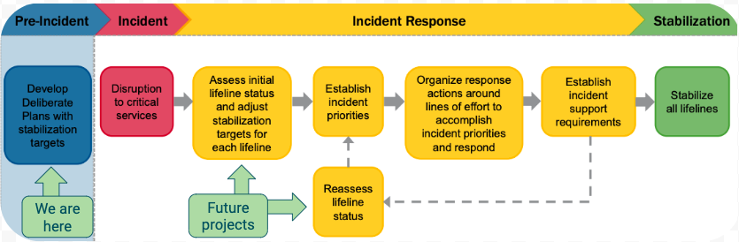

#  FEMA - Lifelines


## Problem Summary

Prior to and during a disaster, it is important to understand the projected and actual effects of the event on the community, including its economic effects on critical services. FEMA has identified seven “lifelines” that require attention during a disaster: (1) Safety & Security; (2) Food, Water, Sheltering; (3) Health and medical; (4) Energy; (5) Communications; (6) Transportation; (7) Hazardous waste. 

Below is an image from [FEMA](https://www.fema.gov/media-library-data/1550596598262-99b1671f270c18c934294a449bcca3ce/Tab1b.CommunityLifelinesResponseToolkit_508.pdf) describing their workflow during a disaster. Within this flow chart we identified areas where data science can play a role both in this project and future projects. 



### Our Goals

1. Estimate and categorize businesses and infrastructure in a city by FEMA Lifelines

2. Understand the distribution of FEMA Lifelines by zipcode using Houston, Texas as our example.

---

## Contents

 **In this Repository**

| Description | Link |
| --- | --- |
| FEMA Lifelines Slides | [Link](./FEMA_Lifelines.pdf)|
| FEMA Lifelines Code | [Link](./FEMA-Lifelines-Project.ipynb)|
| Data Scraping Functions | [Link](./lifelinescrape.py)|
| Datasets | [Link](./datasets)|
| Images | [Link](./images)|
| MIT License | [Link](./LICENSE.md)|

 **Dataset description**

<details>
<summary>All Lifelines</summary>
    
> [All Lifelines Link](./datasets/all_lifelines.csv)
    
| Data | Type | Description |
| --- | --- | :--- |
| Business | string | Name of business or infrastructure returned from Yelp of Google. Each business is represented with one row in this DataFrame.  |
| Category | string | Search term (Google) or category (Yelp) that is used to search respective API |
| Component | string | Subgroup with a lifeline as defined by [FEMA](https://www.fema.gov/media-library-data/1550596598262-99b1671f270c18c934294a449bcca3ce/Tab1b.CommunityLifelinesResponseToolkit_508.pdf). Each lifeline has between 2-6 components. Not all components can be described by a geographic location|
| Latitude | float | Geographic coordinate that specifies the north–south position  |
| Longitude | float | Geographic coordinate that specifies the east-west position  |
| Source | string | Specifies which API was used to pull down this business: Yelp or Google |
| Lifeline | int | 1=Safety & Security, 2=Food, Water, Shelter, 3=Health & Medical, 4=Energy, 5=Communication, 6=Transportation, 7=Hazardous Material|
| Lifeline Name | string | 1 of the 7 Lifeline names as defined by [FEMA](https://www.fema.gov/media-library-data/1550596598262-99b1671f270c18c934294a449bcca3ce/Tab1b.CommunityLifelinesResponseToolkit_508.pdf) |
| Zipcode | int| Zipcode based on the latitude and longitude of the business |
| Mean | string| 'Above' or 'Below' referring to the standing of the zipcode as to whether it is above or below the average lifeline count seen in zipcodes in Houston overall. |

</details>


**Libraries Used**

<details>
<summary>Installs</summary>
    
```   
pip install uszipcode
pip install python-google-places
pip install yelp
```
</details>


<details>
<summary>Imports</summary>
    
```
import requests
import pandas as pd
import json
import time
import seaborn as sns
import matplotlib.pyplot as plt
from scipy import stats
from googleplaces import GooglePlaces
from yelp.client import Client
from lifelinescrape import scrape_google, scrape_yelp, find_lifelines, remove
from uszipcode import SearchEngine
```
</details>

---

## Process Summary

### Step 1. Research Lifelines
> What are these Lifelines?

**1. Approach**
- We split up the research by lifeline. Each person took two or three lifelines and dug into the contents of those lifelines using [FEMA](https://www.fema.gov/media-library-data/1550596598262-99b1671f270c18c934294a449bcca3ce/Tab1b.CommunityLifelinesResponseToolkit_508.pdf) resources. We tried to answer these questions for each lifeline:

    - What are the components?
    - How is FEMA measuring the stability of these components?
    - Do these components have physical locations?
    - Does Houston, TX have any unique resources or industries that apply to these components?
    
    
- Look for these physical locations on Yelp and Google before scraping to see what they look like and what kind of information is available on these locations.

**2. Findings**    
- Some of the components didn't have corresponding physical locations. For example, 911 & Dispatch component of Lifeline: Safety & Security addresses number of calls to 911 and status of responder communication and these don't have corresponding physical locations.


- Some of the businesses returned didn't apply to the component. For example, most restaurants don't address the food component of Lifeline: Food, Water, Shelter.


- Yelp takes in [categories of business type](https://www.yelp.com/developers/documentation/v3/all_category_list) to search and only returns businesses that have at least one comment. This was restrictive for our purposes because large portions of the data we wanted were government buildings and establishments that frequently had no reviews on Yelp.


- GooglePlaces can also take in business categories, but we found it more effective to search with regular search terms. We researched these terms by submitting them on [Google Maps](https://www.google.com/maps) and seeing what places it pulled up. We only got so far as to pull down the first 20 search results, so if the first 20 results of that particular term matched our lifelines, we included it in the list of search terms.

### Step 2. Get Data
> What do these Lifelines look like?

**1. API's**
- The Yelp API and Google Maps API are needed. You may request your own from both at (respectively):
    - [Yelp API link](https://www.yelp.com/developers/)
    - [Google API link](https://developers.google.com/maps/documentation/embed/get-api-key)


**2. Scraping using functions**
- Used `lifelinescrape.py` to import functions that automate the scraping and place data into a pandas.DataFrame. There are *2 types* of functions used.


- *Type 1.*   Because we initially split up the task of digging into these lifelines over a single city(Houston, TX), these functions below are only for Houston, Texas and is designed to only process one Lifeline at a time.
    - `scrape_yelp(tuple_list, lifeline_num, api_key)`
    - `scrape_google(tuple_list, lifeline_num, api_key)`
 
 
-  *Type 2.*   After we finished getting all our data, we realized these functions could easily be translated to other cities. To do this, we had to come up with general search terms that could apply beyond Houston, TX and still meet FEMA Lifeline needs. After coming up with this list we were able to modify the function to take in just a city parameter and automatically find all the lifelines. We only used Google in this function because Yelp often returned unreliable data.
    - `find_lifelines(city, api_key)`
    
### Step 3. Map
> Where are these Lifelines located?

**1. Houston, Texas**
- Using Tableau we were able to map each business and color code them to match Lifeline and their components. Additionally, Tableau has many mapping layers that can be applied including zipcode boundaries, median household income, and streets. 

**2. Find Your City**
- To get a Tableau map to live populate data from an audience selected city we did the following work around:
    - *Python -> .csv -> Tableau -> Tableau Public*
    - The functions saves the dataframe as a new csv file, then in Tableau we `Refresh Data Source` and replace the data being used with the new csv file. Then we save the updated map and then is now viewable on the Tableau Public link.
        
- Towards the end of this part of the project we found that a Tableau library for Python exists and going forward would be worth looking into this in order to skip the additional API keys.

---

## Results

**General Findings**

- Food, Water & Shelter had the highest return of the 7 components, with 327 locations.


- Hazardous Material had the lowest return of the 7, with 27.


- The 7 lifelines are broken down into a total of 33 components.
    - The following components all had above 100 locations found:
        - Financial Services,      195 locations
        - Fuel,                    178 locations
        - Food & Potable Water,    167 locations
        - Medical Care,            140 locations
        - Highway,                 122 locations
        - Shelter,                 100 locations
    - The following components had zero locations found to represent them:
        - responder_safety
        - imminent_hazard_mitigation
        - evacuation
        - durable_goods
        - dispatch_911
        - responder_commmunications
        - hazardous_incident

**Notes on Houston Distribution**

- Houston was significantly more lifeline-dense on the west side of the city, with Interstate Highway 45 and Highway 288 providing an East/West Visual Barrier.

- Running a t-test to compare the means of the above average lifeline count zipcodes group to the below average lifeline count zipcodes groups, I concluded that there is a significant difference between the group of zipcodes with above average lifeline counts and the group of zipcodes with below average Lifeline counts. This means for the city of Houston, TX there is a significant lack of diversity and spread of resources throughout the city. This is supported by additional research about the city showing differences in income, zoning, and historical resource allocations aligning with the locations of our lifelines.

**Maps**

- For demonstration purposes a temporary one page site was developed and may still be available. This site has interactive maps and zip code data by lifeline & component for Houston. [FEMA Lifelines Website](https://public.tableau.com/profile/casey.bruns2800#!/vizhome/MapofHouston/MapofHouston?publish=yes).


- Tableau Public visualizations should still be available with data from Austin, Atlanta, & Chicago. [Visualizations](https://public.tableau.com/profile/casey.bruns2800#!/vizhome/YourCityMap/YourCityMap?publish=yes)
    
---

## Improvements & Next Steps
**Improvements:**
- For this project, we started with the YELP and used Google to supplement. In the future, starting with Google to populate as many of the components as possible and then exploring YELP (and researching further to determine what other sources might yield appropriate information) would likely yield more observations and allow us to tell a more complete story.


- Additionally, I think more time in the discussion and research of the lifelines and their individual components to ensure our search terms authentically meet the goals of the FEMA lifelines as closely as possible. We spent over two days on this and were intentional in the timeframe, but I believe it could still get better as we learn more over time.


**Next Steps:**


- This model serves as a base and could be used to assist FEMA in the first steps of natural disaster planning. It has not yet reached the point of being of service in the event of a hurricane, our natural disaster of focus.


- Learning how to do the following and implementing will help us to support FEMA during and after a hurricane, in addition to before:
    - embed live information about if the businesses/locations are open and functional
    - train a model on prior hurricanes that have hit Houston (Harvey, Ike), to show at any given time which areas and the lifelines within them will still be functional or will be damaged and to what degree

---

## Authors

* **Casey Bruns** - [Github](https://github.com/caseybruns)

* **Adrian Campos** - [Github](https://github.com/adriancampos1)

* **Jacqueline Walker** - [Github](https://github.com/JacquelineEEE)

---

## License

This project is licensed under the MIT License - see the [LICENSE.md](LICENSE.md) file for details

---

## Resources and Acknowledgments

* **Tableau Public** - [Site](https://public.tableau.com/en-us/s/)
    - Tableau Public was utilized to present visualizations and live data presentation
* **Prior students work used as reference/launching point**:
    * [Chicago](https://github.com/micahluedtke/FEMA_lifelines)
    * [Boston](https://github.com/jwasham12/Client-Project)
    * [ATL](https://github.com/awharmon/FEMA-Lifelines-Categorization-for-Disaster-Response)
    
---

